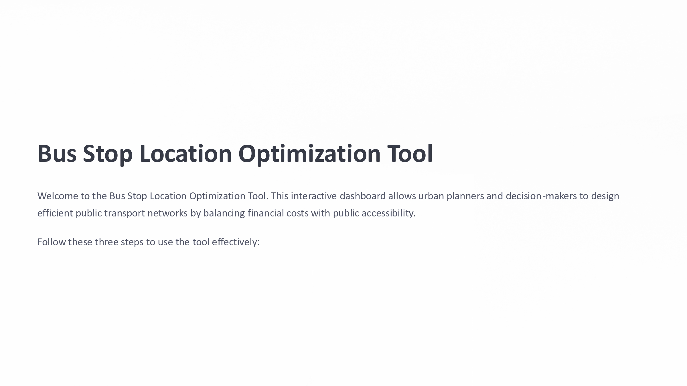
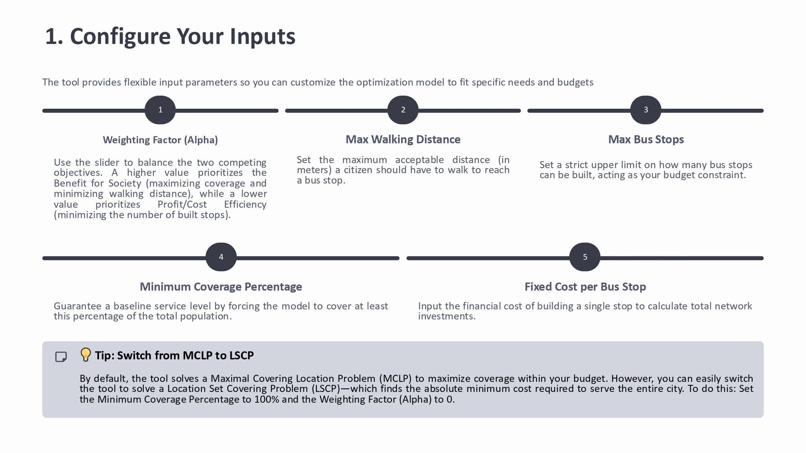
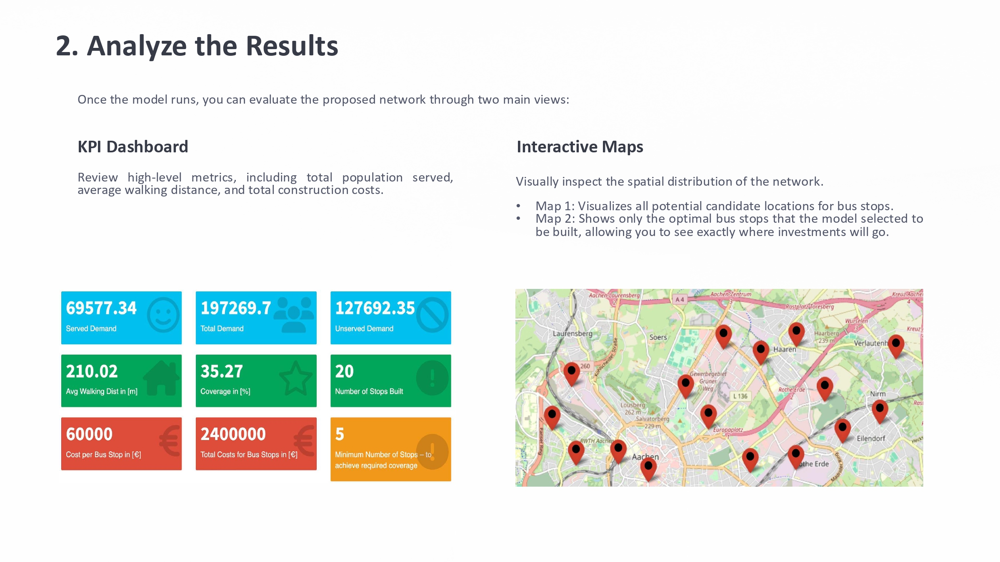
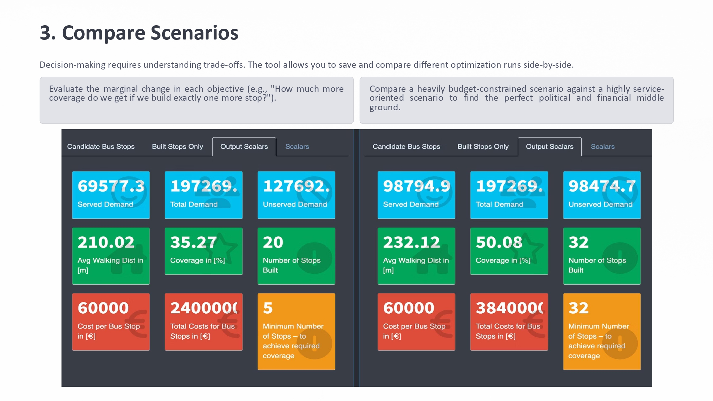

# User Manual: Bus Stop Location Optimization Tool
---
Welcome to the **Bus Stop Location Optimization Tool**. This interactive dashboard supports urban planners and decision-makers in designing efficient public transport networks by balancing accessibility and infrastructure cost.
The app is powered by a mathematical optimization model that extends the traditional Maximum Covering Location Problem (MCLP) with a multi-objective formulation. It allows users to analyze how different planning priorities affect coverage, accessibility, and cost.

The application is deployed as a GAMS MIRO app and uses a custom Python backend implemented with GAMSPy.

---

---

---

